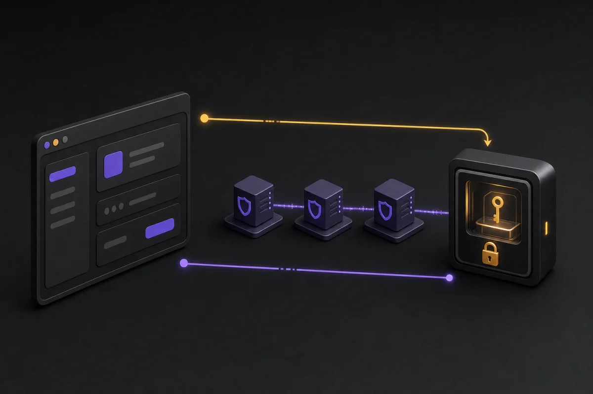

# LNbits External Signer

[](https://github.com/TheCryptoDonkey/externalsigner/actions/workflows/ci.yml)

Use a NIP-46 remote signer from LNbits without importing the user's identity
`nsec`.

External Signer creates a separate, disposable client key for LNbits. Requests
travel to the remote signer through the selected Nostr relays. The signer keeps
the identity key and remains responsible for approving or refusing every
request.

> **Never paste an `nsec` into this extension.** You need a `bunker://` invite
> from the signer, or a signer that can scan a `nostrconnect://` QR.



## Current status

Version `0.1.0` is an unpublished release candidate. The implementation and
independent signer tests pass locally and the public CI matrix is green, but
there is not yet a tagged release, registry installation record or production
soak. Do not present it as a released production extension until every gate in
[RELEASE_CHECKLIST.md](RELEASE_CHECKLIST.md) is complete.

This is an LNbits extension. It is not a wallet backend, Lightning node,
payment processor or second implementation of LNbits.

## Choose the connection route

| What your signer offers | What to choose in External Signer |
| --- | --- |
| A link beginning `bunker://` | **I have a signer invite** |
| A **Scan client QR** or **Connect app** action | **My signer scans QR codes** |
| An `nsec` export only | Stop. Do not use that secret here. |

The two routes establish the same limited NIP-46 client. They differ only in
which side creates the one-use pairing secret.

## Five-minute user guide

Before starting:

- keep the signer open and unlocked;
- decide what LNbits needs to sign;
- use the **Identity proof** preset unless another extension needs more;
- make sure both LNbits and the signer can reach the chosen `wss://` relay.

### Route A: paste a signer invite

1. In the remote signer, create a new client or app connection for LNbits.
2. Copy the complete `bunker://` link.
3. In External Signer, select **I have a signer invite**.
4. Give the connection a recognisable name and paste the link.
5. Choose the smallest permission preset and select **Send invite**.
6. Return to the signer. Approve the connection, public-key request and
   one-off identity proof.
7. Wait for LNbits to show **Connected**.

The invite secret is encrypted until the signer acknowledges it, then erased.

### Route B: create a pairing QR

1. In External Signer, select **My signer scans QR codes**.
2. Give the connection a recognisable name and choose the smallest permission
   preset.
3. Select **Create QR**.
4. In the signer, choose its scan or connect-client action and scan the QR.
5. Check the requested methods and event kinds before approving.
6. Approve the one-off identity proof and wait for **Connected**.

The QR is a ten-minute pairing secret. **Create fresh pairing** makes a new
secret after expiry; it does not revive the old one.

For a standalone walkthrough and troubleshooting explanations, see
[QUICKSTART.md](QUICKSTART.md).

## How to know it worked

**Connected** means all of the following completed:

1. the NIP-46 client and remote signer established an encrypted session;
2. the signer returned the user public key;
3. that user key signed an exact, connection-specific identity challenge;
4. LNbits verified the event signature and every requested field.

Use **Test connection** to request a NIP-46 `ping`. A completed ping confirms a
current signer response, not event publication or payment settlement.

## Permissions

The default **Identity proof** preset grants only:

```text
get_public_key
sign_event:27235
```

Kind `27235` is used for an unpublishable, connection-specific identity proof.
Broad `sign_event` authority is refused. Every allowed kind must be explicit,
for example `sign_event:1`.

The **Nostr Market** preset adds the exact profile, encrypted order, deletion,
stall and product operations needed by that integration:

```text
sign_event:0
sign_event:4
sign_event:5
sign_event:30017
sign_event:30018
nip04_encrypt
nip04_decrypt
```

Selecting a preset requests permission. The remote signer is still the final
policy authority and may require approval or refuse any operation.

## Install for development

Requirements:

- LNbits `1.5.6` or newer and below `2.0`;
- Python `3.10`, `3.11` or `3.12`;
- outbound access to the public `wss://` relays users select.

No additional LNbits extension is required. External Signer uses the public
`nostr-sdk` API already distributed with LNbits.

Until a tagged repository release exists, link this checkout into an LNbits
development tree:

```text
lnbits/extensions/externalsigner -> /path/to/externalsigner
```

Restart LNbits, enable External Signer for a test account and follow the
pairing guide above. Do not use an untagged checkout on a production server.

Administrators should read [ADMIN.md](ADMIN.md) before a
staging or production installation.

## Use from another extension

The service helpers wait for the asynchronous signer response and validate the
returned data before returning:

```python
from lnbits.extensions.externalsigner.services import sign_event

signed = await sign_event(
    user_id,
    connection_id,
    {
        "kind": 30017,
        "content": product_json,
        "tags": [],
        "created_at": created_at,
    },
)
```

Equivalent helpers exist for `nip04_encrypt`, `nip04_decrypt`,
`nip44_encrypt` and `nip44_decrypt`. A signed event is returned only when its
signature, user public key and every unsigned field match the request.

The stable integration contract and error behaviour are documented in
[INTEGRATION.md](INTEGRATION.md).

## Security and operational limits

- The identity `nsec` is never accepted or stored.
- Client keys, pairing secrets, parameters, results, errors and approval URLs
  are encrypted at rest with versioned AES-256-GCM envelopes.
- Public API responses containing account or pairing state use `no-store`.
- Relay subscriptions and publications are isolated to the selected relays.
- Production relays must use `wss://` and resolve only to public addresses.
- An account may have ten active signer connections.
- A connection may have twelve operations waiting for a response and sixty
  user requests per minute.
- Unanswered operations expire after thirty minutes. Completed and failed
  operation records are removed after seven days.
- Revocation sends best-effort `logout`, erases the local client capability and
  purges that connection's operation history.

Read [SECURITY.md](SECURITY.md) and
[ARCHITECTURE.md](ARCHITECTURE.md) for the complete trust boundary.

## Development and verification

```bash
make verify
```

The ordinary suite excludes opt-in signer interoperability. Current evidence,
source commits and physical-hardware limits are recorded in
[VERIFICATION.md](VERIFICATION.md).

## Support the project

External Signer is copyright The Crypto Donkey and released under the MIT
licence. Project support links are deliberately configured in
[`.github/FUNDING.yml`](.github/FUNDING.yml):

- [GitHub Sponsors](https://github.com/sponsors/TheCryptoDonkey)
- [Ko-fi](https://ko-fi.com/brays)

Sponsorship does not buy signing authority, preferential security handling or
access to user keys. These support links do not alter ownership or attribution:
this project is The Crypto Donkey's.

## Licence

MIT. See [LICENSE](LICENSE) and [NOTICE](NOTICE).
